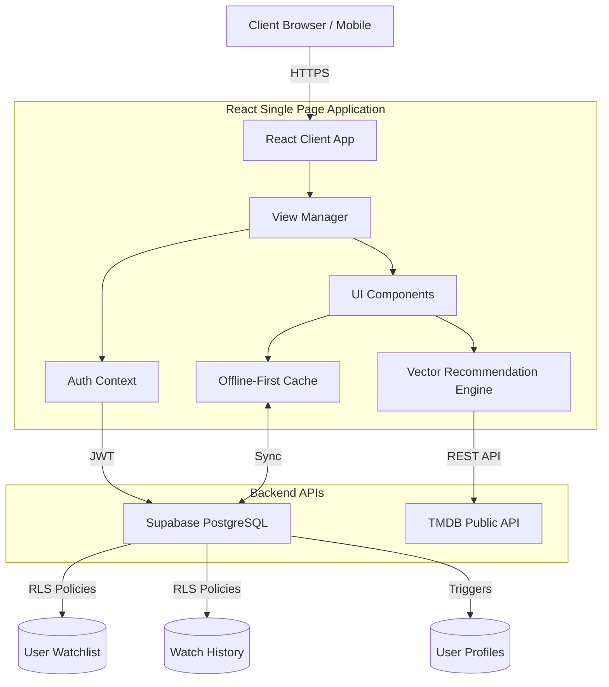

<div align="center">
  
  <h1>ORIZURU | Cinema Reimagined</h1>
  <p><strong>Next-Generation AI-Powered Movie & TV Series Discovery Platform</strong></p>
</div>

<br />

## 🚀 Overview
**ORIZURU** is a premium, AI-driven media discovery engine designed for the modern cinephile. Bypassing traditional, static genre filtering, ORIZURU utilizes vector-based recommendation algorithms to match users with highly personalized content from over 80 countries. Built with an offline-first resilient architecture, it seamlessly scales desktop, tablet, and mobile experiences through intuitive glassmorphic design systems.

---

## ✨ Core Features
- 🧠 **AI Vector Recommendations:** Calculates 8-dimensional cosine similarities across [vibe, pace, genre_type, emotional_tone, era, length, complexity, social] for hyper-accurate content matching.
- 🔐 **Secure Cloud Authentication:** Powered by Supabase. Supports seamless OAuth (Google, GitHub) and Magic Link email auth.
- ⚡ **Offline-First Resilience:** Zero-latency UX via `localStorage` state caching, automatically syncing with the Supabase cloud when internet connectivity resumes.
- 🌍 **Global Content Catalog:** Integrated directly with the TMDB API, featuring realtime data for Movies, TV Series, and regional Anime.
- 🎨 **Dynamic Theming System:** Context-aware UI variables adapting seamlessly between Editorial, Cinematic, Batman, Matte, and Experimental visual modes. 
- 🔒 **Enterprise-Grade Security:** Hardened DOM structure with strict CSP headers, X-Frame-Options, and disabled production sourcemaps.

---

## 🏗️ System Architecture



---

## 📁 Codebase Structure
Following a feature-based modular approach, the repository is structured to maximize scalability and maintain pure component isolation.

```text
ORIZURU/
├── public/                 # Static assets
│   └── favicon.svg         # Application icon
├── src/                    # Primary Source Code
│   ├── services/           # External API & Core Logic
│   │   ├── movieDatabase.js    # Data caching & memory handling
│   │   ├── recommendations.js  # Vector math & cosine similarity engine
│   │   ├── supabase.js         # Cloud database client
│   │   └── tmdb.js             # Data fetching & transformation
│   ├── App.jsx             # Main application orchestrator & routing
│   ├── ErrorBoundary.jsx   # Top-level React error handling
│   └── main.jsx            # Application entry point
├── index.css               # Global Tailwind & Design Token Injection
├── index.html              # Hardened DOM Entry point
├── supabase_schema.sql     # PostgreSQL database schema & triggers
├── tailwind.config.js      # Utility-class generation rules
├── vite.config.js          # Build tool & security header config
└── package.json            # Deployment dependencies
```

---

## 💻 Tech Stack
| Category | Technology |
|---|---|
| **Frontend Framework** | React 18 (Vite) |
| **Styling & Animation** | Tailwind CSS v3, Framer Motion |
| **Icons & SVG** | Lucide React |
| **Cloud Database / Auth**| Supabase (PostgreSQL) |
| **Movie/TV Data** | TMDB API (The Movie Database) |

---

## 🛠️ Installation & Setup

### 1. Prerequisites
- [Node.js](https://nodejs.org/) (v16.x or newer)
- npm or yarn package manager
- A [Supabase](https://supabase.com/) Account
- A [TMDB API](https://www.themoviedb.org/) Key

### 2. Clone the Repository
```bash
git clone https://github.com/your-username/orizuru.git
cd orizuru
```

### 3. Install Dependencies
```bash
npm install
```

### 4. Environment Variables
Create a `.env` file in the root directory and add your development keys. **Never commit this file.**
```env
VITE_TMDB_API_KEY=your_tmdb_api_key_here
VITE_SUPABASE_URL=your_supabase_project_url
VITE_SUPABASE_ANON_KEY=your_supabase_anon_key
```

### 5. Database Configuration
1. Open your [Supabase Dashboard](https://supabase.com/dashboard).
2. Navigate to the **SQL Editor**.
3. Copy the entire contents of `supabase_schema.sql` from this repository.
4. Execute the SQL script to generate the required tables, triggers, and Row Level Security (RLS) policies.
5. In your Supabase settings under **Authentication > Providers**, ensure Email/Password and any OAuth providers are enabled.

### 6. Start Development Server
```bash
npm run dev
```

The application will be available at `http://localhost:3000`.

---

## 🛡️ Security Implementations
- **Row Level Security (RLS):** Enforced at the PostgreSQL level guaranteeing that `watchlist` and `watch_history` rows can inherently only be mutated or accessed by the authenticated UID.
- **CSP & Headers:** Configured natively via `vite.config.js` to strip sourcemaps in production, enforce `nosniff`, and deny IFraming (`DENY`).
- **Data Pruning:** Strict pagination and component dismounting limits React Context memory footprints from overloading client browsers.

---

## 📄 License
This project is proprietary. All rights reserved. 
Data supplied by [TMDB](https://www.themoviedb.org/). ORIZURU uses the TMDB API but is not endorsed or certified by TMDB.
