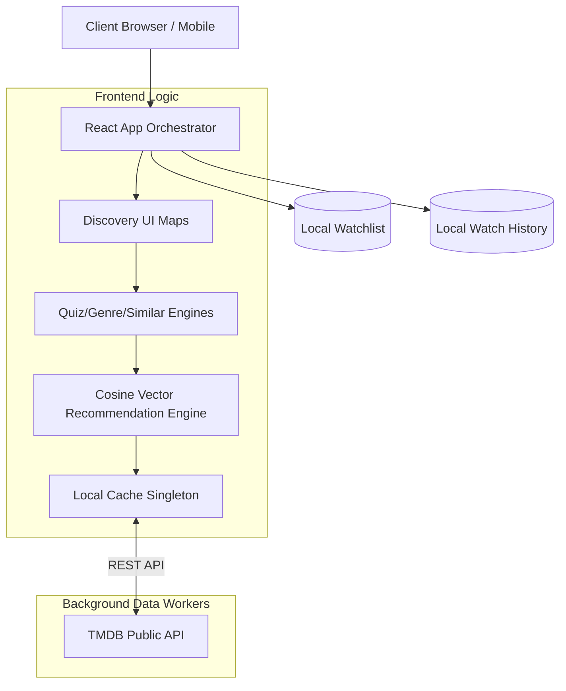

<div align="center">
  
  <h1>ORIZURU | Cinema Reimagined</h1>
  <p><strong>Next-Generation AI-Powered Movie & TV Series Discovery Platform</strong></p>
</div>

<br />

## 🚀 Overview
**ORIZURU** is a premium, AI-driven media discovery engine designed for the modern cinephile. Bypassing traditional, static genre filtering, ORIZURU utilizes vector-based recommendation algorithms to match users with highly personalized content from over 80 countries. Built with a deeply optimized local-first intelligence engine, it seamlessly scales desktop, tablet, and mobile experiences through intuitive glassmorphic design systems.

---

## ✨ Core Features
- 🧠 **Dynamic AI Recommendations:** Calculates 8-dimensional cosine similarities across vibe, pace, genre_type, emotional_tone, era, complexity, and presentation.
- 🎲 **Serendipity Engine:** Injects a dynamic randomization weight into exact mathematical matches, ensuring discovery grids are always organically refreshing and surfacing "Hidden Gems", rather than locking into strict algorithmic loops.
- ⚡ **Local-First Resilience:** Instantaneous UX powered by `localStorage` state caching, `useMemo` optimizations, and a localized `movieDatabase` Singleton for immediate rendering without API latency.
- 🌍 **Global Content Catalog:** Integrated directly with the TMDB API, featuring deep catalogs of Movies, TV Series, KDramas, and regional Anime.
- 🎨 **Dynamic Theming System:** Context-aware UI variables adapting seamlessly between Editorial Warm, Experimental Flux, Gotham Noir, and Dark Matte visual modes. 
- 🔒 **Enterprise-Grade Security:** Hardened DOM structure with strict CSP headers, X-Frame-Options, and disabled production sourcemaps via Vite optimizations.

---

## 🏗️ System Architecture



---

## 📁 Codebase Structure
Following a feature-based modular approach, the repository is structured to maximize scalability and maintain pure component isolation.

```text
ORIZURU/
├── public/                 # Static assets
├── src/                    # Primary Source Code
│   ├── components/         # Isolated React UI components
│   │   ├── auth/           # Landing & Login Views
│   │   ├── common/         # Modals, Skeleton Loaders
│   │   ├── discovery/      # MovieCards, Grid, Filters, ModeSelectors
│   │   └── layout/         # Navbar, Footers, Slideouts
│   ├── context/            # React Context Providers (Toast)
│   ├── hooks/              # Custom React Hooks (useDiscovery)
│   ├── services/           # Core Backend Logic
│   │   ├── movieDatabase.js    # Data caching & memory handling
│   │   ├── recommendations.js  # Vector math & serendipity engine
│   │   └── tmdb.js             # API fetching & transformation
│   ├── App.jsx             # Main application orchestrator & routing
│   └── main.jsx            # Application entry point
├── index.css               # Global Tailwind & Design Token Injection
├── index.html              # Hardened DOM Entry point
├── tailwind.config.js      # Utility-class generation rules
├── vite.config.js          # Build tool & security header config
└── package.json            # Deployment dependencies
```

---

## 💻 Tech Stack
| Category | Technology |
|---|---|
| **Frontend Framework** | React 18 (Vite build system) |
| **Styling & Animation** | Tailwind CSS v3, Framer Motion |
| **Icons & SVG** | Lucide React |
| **Data Persistence** | LocalStorage API (Zero-Backend design) |
| **Movie/TV Data** | TMDB API (The Movie Database) |

---

## 🛠️ Installation & Setup

### 1. Prerequisites
- [Node.js](https://nodejs.org/) (v16.x or newer)
- npm or yarn package manager
- A [TMDB API](https://www.themoviedb.org/) Key

### 2. Clone the Repository
```bash
git clone https://github.com/YUVRAJ-SINGH-3-178/ORIZURU.git
cd orizuru
```

### 3. Install Dependencies
```bash
npm install
```

### 4. Environment Variables
Create a `.env` file in the root directory and add your TMDB key. **Never commit this file.**
```env
VITE_TMDB_API_KEY=your_tmdb_api_key_here
```
*(Note: If a key is not provided, the app will attempt to fallback to an open key, but dedicated environments require absolute self-hosted keys for rate-limit protection).*

### 5. Start Development Server
```bash
npm run dev
```

### 6. Production Deploy
```bash
npm run build
```
Upload the generated `/dist` folder to Vercel, Netlify, or Render.

---

## 🛡️ Production Optimizations
- **Data Pruning:** Strict pagination and component dismounting limits React Context memory footprints from overloading client browsers.
- **Batched API Fetching:** The `movieDatabase` uses a controlled, chunked loading mechanism with 200ms sleep delays to natively avoid HTTP 429 Rate Limit Errors from TMDB.
- **Vector Transformation:** Data arrays are pre-flattened and converted to mathematical representations upon initialization, granting true `O(1)` runtime querying performance on the frontend.

---

## 📄 License
This project is proprietary. All rights reserved. 
Data supplied by [TMDB](https://www.themoviedb.org/). ORIZURU uses the TMDB API but is not endorsed or certified by TMDB.
